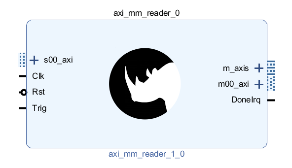
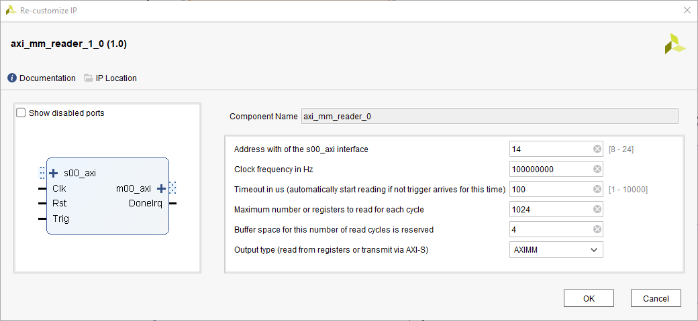

# AXI MM Reader IP-Core Documentation

## Overview

This IP-Core allows reading a list of 32-bit registers over AXI-4 periodically or upon trigger events. The registers read can either be read by software from an internal FIFO or they are transmitted through an AXI-Stream interface. Which option is used, is configurable in the GUI.

The register addresses to be read are defined in a small RAM. For every read cycle, the IP-Core iterates through this table and reads all the registers configuredc. The values read are then made available through the interface configured.

The intended usages of the IP-Core are:
* Converting values that are only accessible through registers (e.g. temperature/voltage of the System-Monitor) to AXI-Stream
* Get state of status registers at exact points in time (compared to reading by SW which always has quite a lot of jitter)

## License
This library is published under [PSI HDL Library License](License.txt), which is [LGPL](LGPL2_1.txt) plus some additional exceptions to clarify the LGPL terms in the context of firmware development.

## IP Integration

### Interfaces

The figure below shows the IP as showing up in Vivado IPI.

* The IP-Core has a common clock/reset for all interfaces. If different clocks are required, clock-crossing components must be added externally.
* Whenever a pulse on the trigger inputs occurs, the IP-core executes a register read cycle.
  * Trigger input pulses while a read cycle is still going on are ignored
  * Only use pulses as inputs (exactly one high-cycle)
* The *s00\_axi* AXI interface is used to configure the registers of the IP-Core
* The *m00\_axi* Interface is used to read the registers configured
* DoneIrq pulses (one high-cycle) when a read cycle was ompleted
* The *m\_axis* port is present or not depending on the IP-Configuration
  * If register values are transmitted over AXI-Stream, this port is present
  * If register values are read via register bank from the internal FIFO, this port is not present

### Configuration GUI

The figure below shows the configuration GUI:

The parameters are briefly described here:
* **Address Width of the s00_axi interface**
  * The address width must be set to at least **_ceil(log2(MaxRegisters x 4 + 32))_** 
* **Clock frequency in Hz**
  * The clock frequency is required to calculate the timeout (see below)
* **Timeout in us**
  * If the core is enabled (see register bank description) and no trigger inputs arrive, a read-cycle is started after this time. This functionality can also be used to configure periodic reads by applying a timeout and not using the trigger input.
* **Maximum number of registers to read for each cycle**
  * Number of entries in the configuration ROM. The number of registers to read can be configured at runtime to be smaller than the maximum number of registers.
* **Buffer space for this number of read cycles is reserved**
  * The IP-Core contains a FIFO for buffering register read-values. The number of complete read cycles to be buffered in these FIFOs can be set here. In the default configuration (see screenshot), up to 4096 register values (4 x 1024) can be buffered in this FIFO. Hence SW has to react within four read-cycles to not loose any data. This option is especially useful if SW is receiving the read data and real-time performance cannot be guaranteed (e.g. because the SW is running on Linux).
* **Output type**
  * AXIS - Register read values are transmitted over an AXI-S interface
  * AXIMM - Register read values are received by SW over a FIFO that is mapped to the register space of the IP-Core

## Register Bank

### Register Modes

| Mode | Description              |
|:----:|:-------------------------|
| R    | Read only                |
| W    | Write only               |
| RW   | Read/write               |
| RV   | Read with side effect    |
| RCW1 | Ready, clear by wrigin 1 |

### Registers

| Address | Name   | Mode | Bits | Description |
|:-------:|:------:|:----:|:----:|:------------|
| 0x00    | Ena    | RW   | 0    | Enable IP-Core |
| 0x04    | RegCnt | RW   | 31:0 | Number of registers to read (first N entries in the *RegTable* are used).  Do not change while IP is enabled. |
| 0x08    | RdData | RV   | 31:0 | Register read value FIFO. Reading this register removes the entry read from the FIFO.   Only present for *Output type = AXIMM* |
| 0x0C    | RdLast | R    | 0    | 1 = current value in *RdData* is the last of a read-cycle  Only present for *Output type = AXIMM* |
| 0x10    | Level  | R    | 31:0 | Level of the internal read value buffer FIFO |
| 0x20    | Addr[0] | RW  | 31:0 | Address of first register to read |
| 0x24    | Addr[1] | RW  | 31:0 | Address of second register to read |
| ...     | ...     | ... |....  | ... |

When operating in *AXIMM* output mode, the *RdLast* must be read before *RdData* because reading *RdData* removes the entry from the FIFO.

 